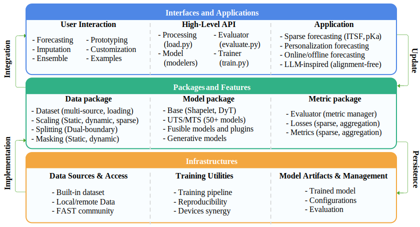

# pyFAST: Flexible, Advanced Framework for Multi-source and Sparse Time Series Analysis in PyTorch

[](asset/overview.svg)

[pyFAST](https://github.com/freepose/pyFAST) (Forecasting And time-Series in PyTorch) is a modular Python framework for time series analysis, with particular focus on multi-source and sparse data scenarios. Built on PyTorch, pyFAST provides a unified platform for forecasting, imputation, and generative modeling, integrating LLM-inspired architectures, Variational Autoencoders, and classical time series models.

**Use Cases:**

*   **Alignment-Free Multi-source Time Series Analysis:** Process and fuse data from diverse sources without requiring strict temporal alignment, using Large Language Model principles.
*   **Sparse Time Series Forecasting:** Handle and forecast sparse time series data with specialized metrics and loss functions.
*   **Research Prototyping:** Experiment with time series models and techniques using flexible, modular components.
*   **Customization and Extension:** Adapt the library to specific research or application needs through component-based design.
*   **Large-scale Processing:** Handle large datasets and complex models with optimized PyTorch implementations and multi-device support.

**Key Features:**

*   **LLM-Inspired Models:** Adaptations of Large Language Models for alignment-free multi-source time series forecasting.
*   **Sparse Data Support:** Comprehensive support for sparse time series, including specialized metrics, loss functions, and efficient data handling.
*   **Multi-source Data Fusion:** Integrate and analyze time series data from diverse, potentially misaligned sources.
*   **Model Library:** Includes classical, deep learning (Transformers, RNNs, CNNs, GNNs), and generative time series models for both multivariate (MTS) and univariate (UTS) data.
*   **Modular Architecture:** Component-based design enables customization, extension, and combination of modules.
*   **Training Pipeline:** `Trainer` class simplifies model training with built-in validation, early stopping, checkpointing, and multi-device support.
*   **Evaluation Suite:** Includes standard and sparse-specific evaluation metrics via the `Evaluator` class.
*   **Generative Modeling:** Dedicated module for time series Variational Autoencoders (VAEs), including Transformer-based VAEs.
*   **Reproducibility:** Utilities like `initial_seed()` ensure experiment reproducibility.

**Core Modules:**

The pyFAST `fast/` library is structured into five core modules:

*   **`data/` package:**  Handles data loading, preprocessing, and dataset creation for SST, SMT, MMT, and BDP data scenarios.  Key features include efficient sparse data handling, multi-source data integration, scaling methods, patching, and data splitting utilities.
*   **`model/` package:**  Houses a diverse collection of time series models, categorized into `uts/` (univariate), `mts/` (multivariate), and `base/` (building blocks) submodules. Includes classical models, deep learning architectures (CNNs, RNNs, Transformers, GNNs), fusion models, and generative models.
*   **`train.py` Module:**  Provides the `Trainer` class to streamline the entire model training pipeline. Features include device management, model compilation, optimizer and scheduler management, training loop, validation, early stopping, checkpointing, and visualization integration.
*   **`metric/` package:** Offers a comprehensive suite of evaluation metrics for time series tasks, managed by the `Evaluator` class. Includes standard metrics (MSE, MAE, etc.) and specialized sparse metrics for masked data.
*   **`generative/` package:** (Optional, if you want to highlight) Focuses on generative time series modeling, providing implementations of Time series VAEs and Transformer-based VAEs.

**Currently Supported Models**

| Variables                     | Time Series      | Sparse Time Series    |
|-------------------------------|------------------|-----------------------|
| wo Exogenous                  | ✅ ts             | ✅ ts_mask             |
| Exogenous                     | ✅ ts_ex          | ✅ ts_mask_ex          |
| Exogenous sparse              | ✅ ts_ex_mask     | ✅ ts_mask_ex_mask     |
| Exogenous2                    | ✅ ts_ex2         | ✅ ts_mask_ex2         |
| Exogenous + Exogenous2        | ✅ ts_ex_ex2      | ✅ ts_mask_ex_ex2      |
| Exogenous sparse + Exogenous2 | ✅ ts_ex_mask_ex2 | ✅ ts_mask_ex_mask_ex2 |
| Static                        | ❌ ts_static      | ❌ ts_mask_static      |

Symbols:

- ✅ = supports / typically adaptable
- ❌ = does not natively support
- ✶ = sparse (sparsely observed targets or exogenous features)

## Installation

Ensure you have Python installed. Then, to install pyFAST and its dependencies, run:

```bash
pip install -r requirements.txt
```

## Getting Started

### Basic Usage Example

Here's a basic example to get started with pyFAST:

```python
import torch

from fast import initial_seed, initial_logger, get_device
from fast.data import SSTDataset
from fast.train import Trainer
from fast.metric import Evaluator
from fast.model.mts.ar import ANN  # Example: Using a simple ANN model

# Initialize components for reproducibility and evaluation
initial_seed(2025)

# Initialize logger for tracking training progress
logger = initial_logger()

# Prepare your time series data: replace with actual data loading.
ts = torch.sin(torch.arange(0, 100, 0.1)).unsqueeze(1)  # Shape: (1000, 1)
train_ds = SSTDataset(ts, input_window_size=10, output_window_size=1).split(0, 0.8, mark='train')
val_ds = SSTDataset(ts, input_window_size=10, output_window_size=1).split(0.8, 1., mark='val')

# Initialize the model (e.g., ANN)
model = ANN(
    input_window_size=train_ds.input_window_size,  # Adapt input window size from dataset
    output_window_size=train_ds.output_window_size,  # Adapt output window size from dataset, a.k.a. prediction steps
    hidden_sizes=32  # Hidden layer size
)

# Set up the Trainer for model training and evaluation
device = get_device('cpu')  # Use 'cuda', 'cpu', or 'mps'
evaluator = Evaluator(['MAE', 'RMSE'])  # Evaluation metrics
trainer = Trainer(device, model, evaluator=evaluator)

# Train model using prepared datasets
history = trainer.fit(train_ds, val_ds, epoch_range=(1, 10))  # Train for 10 epochs
logger.info(str(history))

# After training, evaluate on a test dataset (if available)
val_results = trainer.evaluate(val_ds)
logger.info(str(val_results))
```

### Data Structures Overview

pyFAST is designed to handle various time series data structures:

*   **Multiple Time Series (MTS):**
    *   Shape: `[batch_size, window_size, n_vars]`
    *   For datasets with multiple variables recorded over time (e.g., sensor readings, stock prices of multiple companies).

*   **Univariate Time Series (UTS):**
    *   Shape: `[batch_size * n_vars, window_size, 1]`
    *   For datasets focusing on single-variable sequences, often processed in batches for efficiency.

*   **Advanced Data Handling:**
    *   **Sparse Data Support:** Models and metrics work with sparse time series data and missing values, using masks for accurate computations.
    *   **Exogenous Variable Integration:** Incorporate external factors (exogenous variables) into time series models.
    *   **Variable-Length Sequence Support:** Uses dynamic padding to process time series with varying lengths within batches.
## Benchmarking Performance

pyFAST has been evaluated against established time series libraries and models on benchmark datasets.
View benchmarks on [Google Sheets](https://docs.google.com/spreadsheets/d/1y_mhUeWeEBOW88UoXv7_r9Cyyf2q2DKz/edit?usp=sharing&ouid=118431230685867986241&rtpof=true&sd=true).
You can also download the local Excel: [benchmarks.xlsx](asset/benchmarks_20250824.xlsx).
Datasets available at [FAST](https://zenodo.org/communities/fast/) community in ZENODO.

## Citation

**BibTeX format**

```bibtex
@article{corr2025/Wang,
    author    = {Wang, Zhijin and Wu, Senzhen and Hu, Yue and Liu, Xiufeng},
    title     = {pyFAST: A Modular PyTorch Framework for Time Series Modeling with Multi-source and Sparse Data},
    journal   = {arXiv preprint},
    year      = {2025},
    url       = {https://arxiv.org/abs/2508.18891},
}
```

**APA/Plain format**

Zhijin Wang, Senzhen Wu, Yue Hu, Xiufeng Liu. 2025. pyFAST: A Modular PyTorch Framework for Time Series Modeling with Multi-source and Sparse Data. arXiv
preprint arXiv:2508.18891. https://arxiv.org/abs/2508.18891

## Contact

Please feel free to contact Zhijin Wang ([zhijin@jmu.edu.cn](zhijin@jmu.edu.cn)).

## License

MIT License

Copyright (c) 2024 pyFAST Contributors

Permission is hereby granted, free of charge, to any person obtaining a copy of this software and associated documentation files (the "Software"), to deal in the Software without restriction, including without limitation the rights to use, copy, modify, merge, publish, distribute, sublicense, and/or sell copies of the Software, and to permit persons to whom the Software is furnished to do so, subject to the following conditions:

THE SOFTWARE IS PROVIDED "AS IS", WITHOUT WARRANTY OF ANY KIND, EXPRESS OR IMPLIED, INCLUDING BUT NOT LIMITED TO THE WARRANTIES OF MERCHANTABILITY, FITNESS FOR A PARTICULAR PURPOSE AND NONINFRINGEMENT. IN NO EVENT SHALL THE AUTHORS OR COPYRIGHT HOLDERS BE LIABLE FOR ANY CLAIM, DAMAGES OR OTHER LIABILITY, WHETHER IN AN ACTION OF CONTRACT, TORT OR OTHERWISE, ARISING FROM, OUT OF OR IN CONNECTION WITH THE SOFTWARE OR THE USE OR OTHER DEALINGS IN THE SOFTWARE.
